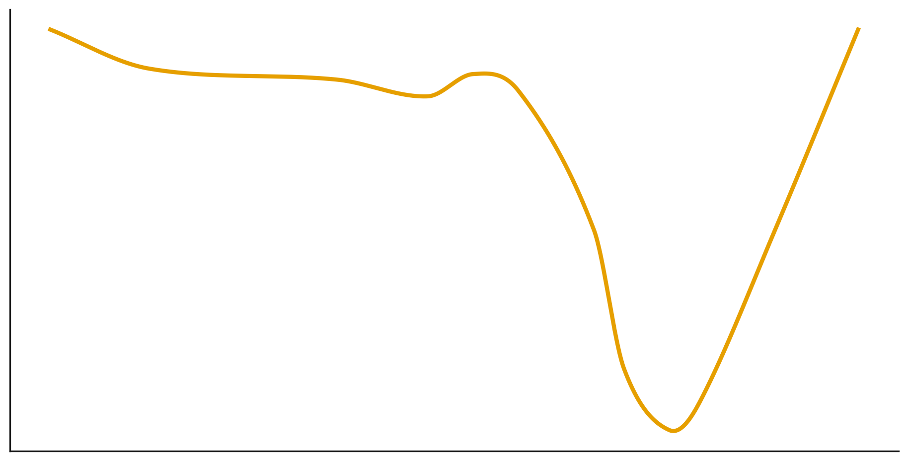

$
 \min_x f(x)$，$g_t=\nabla f(x_t)
 $
（或小批量的随机梯度）。
记号：逐元素乘 **⊙**、逐元素除 **⊘**、逐元素平方 $g_t^{\;2}=g_t⊙g_t$。投影到可行域 $X$ 时，把最后一步替换为 $x_{t+1}=P_X(\;\cdot\;)$。

---

# 1) 动量法（Heavy-Ball / Momentum）

**状态量**：速度 $v_t$。
**超参**：学习率 $\alpha>0$、动量系数 $\beta\in[0,1)$。
**初始化**：$x_0$ 给定，$v_0=0$。

$$
\boxed{
\begin{aligned}
v_{t+1} &= \beta\,v_t + g_t,\\
x_{t+1} &= x_t - \alpha\,v_{t+1}.
\end{aligned}}
$$

> 说明：有些库写成 $v_{t+1}=\beta v_t+(1-\beta)g_t$，再用 $x_{t+1}=x_t-\alpha v_{t+1}$；两者仅是对 $\alpha$ 的等价缩放。

优点：

1、由于存在动量，可以有效逃离局部最小值

2、减小在最小值反复震荡的现象

缺点：

1、无法解决单方向上缓坡行动缓慢的问题;

2、可能发生“跳崖”现象

# 2) AdaGrad（逐坐标自适应）

**状态量**：二阶累积 $r_t$（逐坐标梯度平方和）。
**超参**：$\alpha>0$、$\varepsilon>0$（数值稳定）。
**初始化**：$r_0=0$。

$$
\boxed{
\begin{aligned}
r_{t+1} &= r_t + g_t^{\;2},\\
x_{t+1} &= x_t - \alpha\; g_t \;⊘\; (\sqrt{r_{t+1}}+\varepsilon).
\end{aligned}}
$$

优点：

1、一定程度上解决了动量法的单方向缓坡行动缓慢的问题

2、由于步长小，在一定程度上缓解了跳崖现象

3、避免在最小值处反复震荡

缺点：

1、由于分母不减，导致模型后期失去学习能力

2、由于后期更新步长极小，容易陷入局部最小值

# 3) RMSProp（指数滑动平均的二阶量）
使用指数加权移动平均替换掉AdaGrad对梯度的平方的简单累加，更关注最近的行为

**状态量**：二阶指数平均 $r_t$。
**超参**：$\alpha>0$、衰减 $\rho\in[0,1)$（常 0.9–0.99）、$\varepsilon>0$。
**初始化**：$r_0=0$。

$$
\boxed{
\begin{aligned}
r_{t+1} &= \rho\, r_t + (1-\rho)\, g_t^{\;2},\\
x_{t+1} &= x_t - \alpha\; g_t \;⊘\; (\sqrt{r_{t+1}}+\varepsilon).
\end{aligned}}
$$

优点：

1、解决了AdaGrad后期模型丧失学习的能力

缺点：

1、难以逃离鞍点

2、逃离局部最小值的能力较弱

# 4) Adam（动量 + 逐坐标自适应）
发现RMSProp和动量法具有互补特性，让动量法只对一定时间内的梯度进行加权平均，将调节学习率和影响加速减速的任务交给RMSProp

**状态量**：一阶动量 $m_t$、二阶动量 $v_t$；带偏置校正 $\hat m_t,\hat v_t$。
**超参**：$\alpha>0$、$\beta_1\in[0,1)$、$\beta_2\in[0,1)$、$\varepsilon>0$。
**初始化**：$m_0=0,\ v_0=0$。

$$
\boxed{
\begin{aligned}
g_t &= \nabla f(x_t),\\
m_{t+1} &= \beta_1 m_t + (1-\beta_1)\, g_t,\\
v_{t+1} &= \beta_2 v_t + (1-\beta_2)\, g_t^{\;2},\\
\hat m_{t+1} &= \dfrac{m_{t+1}}{1-\beta_1^{\,}},\qquad
\hat v_{t+1} = \dfrac{v_{t+1}}{1-\beta_2^{\,}},\\
x_{t+1} &= x_t - \alpha\; \hat m_{t+1} \;⊘\; \big(\sqrt{\hat v_{t+1}}+\varepsilon\big).
\end{aligned}}
$$

