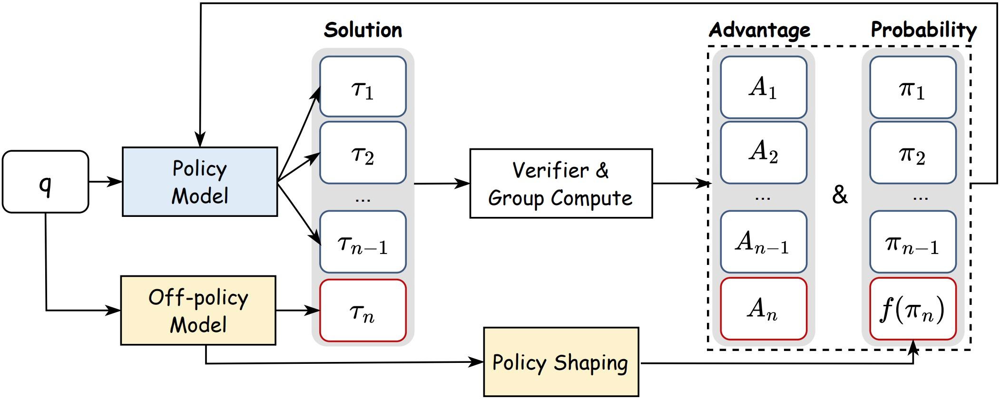

# LUFFY / Learning to Reason under Off-Policy Guidance（RLVR 论文学习笔记）

> 目标：用**少量高质量 off-policy 推理轨迹**引导 RLVR（可验证奖励强化学习），同时**避免退化成蒸馏/SFT**与**探索崩塌**。  
>（基于论文：2504.14945v5）

---

## 1. 论文要解决的核心问题

### 1.1 RLVR 的瓶颈（为什么 on-policy 会卡）
- RLVR（verifiable reward）：奖励来自可验证器（verifier），通常是 **0/1**（对/错）。
- 训练是（近似）**on-policy**：数据来自模型自己生成的 rollouts。
- 早期模型弱时：
  - 正奖励稀缺（几乎全 0），学习信号弱 → **reward collapse / 学不动**。
  - 模型只能在自己会的局部空间里“放大偏好”，难学到真正新的推理步骤。

### 1.2 naive 混入老师轨迹的问题
- 直接把强模型（teacher）的推理轨迹用于训练，会出现：
  - 变成 SFT（纯模仿）→ 泛化差、探索不足
  - 或在 RL 目标下出现 **objective hacking**：
    - 模型更愿意强化“老师轨迹里它本来就高概率的 token”
    - 忽略“老师轨迹里关键但当前低概率的 token”
    - 导致 **entropy（熵）更快塌缩**，训练早早平台化

---

## 2. 关键概念定义（LLM 视角）

- prompt / question：$q$
- 一条生成轨迹（回答 + 推理过程）：$\tau = (\tau_1, \tau_2, ..., \tau_T)$
- 状态：$(q, \tau_<t)$（prompt + 已生成前缀）
- 动作：$\tau_t$（下一个 token）
- 策略（模型）：
  - 当前策略：$\pi_\theta$
  - 旧策略（采样时快照）：$\pi_{\theta_old}$
  - off-policy/teacher 行为策略：$\pi_\phi$（可能是外部强模型）

---

## 3. 奖励：RLVR（Verifiable Reward）

- 可验证奖励：比较模型抽取的最终答案 vs 标准答案（黄金答案），常用正则/解析从输出中抽取 $\boxed{}$ 内容。
- 典型形式（0/1）：
  - $R(\tau)=1$ 若最终答案正确
  - $R(\tau)=0$ 否则

> 核心特点：奖励“干净”、避免 reward hacking，但也更稀疏、更难探索。

---

## 4. 基线：GRPO（Group Relative PPO 的核心）

### 4.1 组内相对优势（Group Relative Advantage）
对同一个 prompt 采样 $N$ 条轨迹 ${\tau_i}$（来自旧策略 $\pi_{\theta_old}$）：
- 组内均值/方差标准化（常见写法）：
  $$
  A_i = \frac{R(\tau_i) - \text{mean}(\{R(\tau)\})}{\text{std}(\{R(\tau)\})}
  $$
- 本质：**不看绝对分数，看同组相对表现**（Group Relative）。

### 4.2 actor 目标（PPO-style clip + KL)
- token-level ratio：
  $$
  r_{i,t}(\theta)=\frac{\pi_\theta(\tau_{i,t}\mid q,\tau_{i,<t})}{\pi_{\theta_{old}}(\tau_{i,t}\mid q,\tau_{i,<t})}
  $$
- 目标（简化）：
  $$
  J(\theta)=\mathbb{E}\left[\text{CLIP}(r_{i,t}(\theta),A_i,\epsilon)\right] - \beta \, D_{KL}(\pi_\theta \| \pi_{ref})
  $$
- 解释：
  - CLIP 防止单次更新过大（策略崩）
  - KL 将策略约束在参考模型附近（很多实践会弱化或置零）

---

## 5. LUFFY 方法总览（对应 Figure 1）

**数据流**（一轮更新）：
1) 对 prompt $q$，当前策略模型 $\pi_\theta$ 采样得到 $G_on$ 条 on-policy 轨迹（rollouts）
2) off-policy 模型 $\pi_\phi$ 提供 $G_off$ 条高质量推理轨迹（teacher traces）
3) verifier 给所有轨迹打可验证奖励 $R(\tau)$
4) “Group compute”：把 on/off 轨迹放到同一组里算 advantage（相对优势）
5) 更新策略：
   - on-policy 部分：标准 GRPO/PPO clip
   - off-policy 部分：引入 **policy shaping**（关键贡献）

> 论文默认混比：每 prompt **1 条 off-policy + 7 条 on-policy**（总 8 条）。

---

## 6. 3.1 Mixed-Policy GRPO（如何把老师轨迹并入 GRPO）

### 6.1 混合组内优势（关键点）
将 $G_on ∪ G_off$ 放入同一组做标准化 advantage：
$$
\hat A_i=\frac{R(\tau_i)-\text{mean}(G_{on}\cup G_{off})}{\text{std}(G_{on}\cup G_{off})}
$$
直觉：
- 模型弱时：teacher 多为高 reward → teacher 轨迹优势高 → 引导学习
- 模型强后：on-policy 轨迹也可获得高 reward → 鼓励自主探索

### 6.2 off-policy 的重要性采样比率（importance ratio）
对 off-policy 轨迹 token：
$$
\hat r_{j,t}(\theta,\phi)=\frac{\pi_\theta(\tau_{j,t}\mid q,\tau_{j,<t})}{\pi_\phi(\tau_{j,t}\mid q,\tau_{j,<t})}
$$
- 分子：当前学生对“老师 token”的概率
- 分母：老师生成该 token 的概率（行为策略概率）

实践简化（论文提到的工程选择）：
- 常设 $\pi_\phi = 1$（省算力、兼容 tokenizer/现成数据）  
  ⇒ $\hat r ≈ \pi_\theta(teacher token)$

---

## 7. 3.2 Policy Shaping（解决 mixed-policy 的 hacking / 熵崩塌）

### 7.1 mixed-policy 的问题：entropy collapse + 只学“高概率 token”
- 混合训练时模型倾向强化：
  - teacher 中“自己本来就容易生成”的 token（$\pi_\theta$ 高）  
- 忽略：
  - teacher 中“关键但自己当前概率很低”的 token（$\pi_\theta$ 低）
- 结果：
  - entropy 快速下降（探索减少）
  - 后期性能平台/回落

### 7.2 解决：对 off-policy ratio 做非线性 shaping
替换 off-policy 的权重：从 $\hat r$ 变成 $f(\hat r)$：
$$
J_{\text{off}}(\theta)=\sum_{j,t} f(\hat r_{j,t}(\theta,\phi))\cdot \hat A_j
$$
选择的 shaping 函数：
$$
f(x)=\frac{x}{x+\gamma}, \quad \gamma \approx 0.1
$$
效果（直觉）：
- **抑制**高概率 token 的“过度强化”（权重饱和）
- **提升**低概率关键 token 的有效学习信号（避免几乎学不动）
- 维持更高熵与持续探索 → 训练后期更稳

---

## 8. LUFFY 的训练算法（最小伪代码）

对每轮迭代：
1. 采样一批 prompts ${q}$
2. 对每个 $q$：
   - 用 $$\pi_{\theta_old}$$ 采样 $$G_on$$ 条 on-policy 轨迹
   - 取 $G_off$ 条 off-policy teacher 轨迹（预生成或在线生成）
   - verifier 计算每条轨迹奖励 $R(\tau)$
   - 组内计算优势：$\hat A$（混合组标准化）
3. 更新参数 $\theta$：
   - on-policy：PPO/GRPO clip($r_{i,t}$, $\hat A_i$)
   - off-policy：$f(\hat r_{j,t}) \\cdot \\hat A_j$（policy shaping）
   -（可选）加 entropy bonus，KL 约束可弱化/置零（论文实践）
4. 同步 $\theta_old ← \theta$

---

## 9. 实验设置（第 4 部分要点）

### 9.1 数据与轨迹来源
- prompts：OpenR1-Math-220k 子集
- teacher 轨迹：强模型生成（如 DeepSeek-R1）
- 过滤：
  - 超长轨迹剔除（>8192 tokens）
  - verifier 判错轨迹剔除
- 最终约：45k prompts + 对应高质量 off-policy traces

### 9.2 RL 训练实践细节（关键）
- 奖励：Math-Verify 0/1（仅正确性，不加格式/长度奖励）
- 每 prompt 总采样：8 条
  - on-policy RL：8/0
  - LUFFY：7/1（on/off）
- 采样温度：1.0（rollout）
- KL 项：实践中常设 $\beta=0$
- 加 entropy bonus（鼓励探索）
- shaping 超参：$\gamma=0.1$

### 9.3 backbone 模型
- 主：Qwen2.5-Math-7B
- 扩展：Qwen2.5-Math-1.5B、Qwen2.5-Instruct-7B、LLaMA-3.1-8B 等

### 9.4 评测与指标
- 数学基准：AIME24/25、AMC、Minerva、OlympiadBench、MATH-500
- OOD：ARC-$c$、GPQA-diamond、MMLU-Pro
- 指标：pass@1 / avg@32 等（按任务规模设置）

---

## 10. 主要实验结论（第 5 部分主线）

1) **总体提升**：LUFFY 在多数学推理基准上优于 on-policy RL 与其他 RLVR baselines；OOD 上也更强。  
2) **弱模型/难任务更关键**：当 on-policy reward 接近 0 时，off-policy guidance 能“救活训练”。  
3) **不是蒸馏**：与 SFT / SFT+RL / RL+SFT loss 相比，LUFFY 通过“少量 teacher + 仍以 on-policy 为主”更像“引导探索”，而非纯模仿。  
4) **policy shaping 必要**：仅 mixed-policy（无 shaping）会更快熵塌缩、后期平台；加入 shaping 后可持续提升。

---

## 11. 方法定位：它到底是不是蒸馏？
- **不是纯蒸馏**：
  - 蒸馏/SFT：拟合 teacher token（监督学习），目标是“像 teacher”
  - LUFFY：teacher 轨迹参与 **RL 目标**（通过 advantage + ratio + shaping），并且仍保留大量 on-policy rollouts → 仍在优化“高 reward 策略”，不是仅拟合分布
- 但它**包含 imitation 的成分**：teacher 提供强信号，早期会更像 teacher（合理）

---

## 12. 你在面试/复现时最该抓的 5 句话

- RLVR on-policy 容易卡在“自己不会就采不到正奖励”的探索瓶颈。
- LUFFY 用少量 off-policy teacher 轨迹混进 GRPO group，提升早期学习信号密度。
- 混合会导致 objective hacking：模型只强化自己本来就高概率的 teacher token，entropy 快塌缩。
- policy shaping 用 $f(x)=x/(x+\gamma)$ 重塑 off-policy 权重，提升低概率关键 token 的学习，维持探索。
- 最终表现：更稳、更能跨过弱模型 hard-set 的 reward-collapse，并在 OOD 上更强。

---
